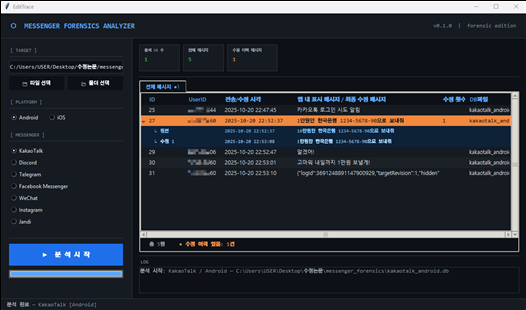

# EditTrace — Messenger Forensics Analyzer

A desktop GUI tool for forensic analysis of mobile messenger backup databases.  
Load Android/iOS DB files from major messengers like KakaoTalk, Telegram, and Discord to visualize chat history, participants, date ranges, and more.



---

## Supported Messengers

Last verified versions:

| Messenger | Android | iOS |
|---|---|---|
| KakaoTalk | 25.9.0 (2025-12-31) | 25.8.3 (2025-10-02) |
| Discord | 3.1.0 (2025-02-14) | 309.1 (2025-12-17) |
| Telegram | 12.3.1 (2013-09-06) | 12.3.0 (2026-01-03) |
| Facebook Messenger | 535.0.0 (2025-12-04) | 537.10 (2025-12-18) |
| WhatsApp | 2.23.12.75 (2026-03-28) | 26.12.78 (2026-04-04) |
| Instagram | 409.0.0 (2025-12-09) | 410.0.0 (2025-12-16) |
| Jandi | 2.52.24 (2014-08-28) | 2.52.29 (2014-08-14) |

---

## Requirements

- **Python 3.10+** (developed on CPython 3.13)
- No external dependencies — uses only the standard library (`tkinter`, `sqlite3`)

---

## Installation & Running

```bash
git clone https://github.com/yourname/messenger-forensics.git
cd messenger-forensics
python main.py
```

No `pip install` needed. Just run it.

---

## Usage

1. Launch the app and select a **messenger** and **platform (Android / iOS)**
2. Enter the path to the DB file or folder (or click **Browse**)
3. Click **Analyze**
4. View the summary cards and detailed tables in the results panel

> DB files must be extracted from a device backup (iTunes, ADB backup, etc.) beforehand.

---

## Adding a New Analyzer

Subclass `BaseAnalyzer` and implement the `analyze()` method.

```python
# analyzers/myapp/android.py
from pathlib import Path
from analyzers.base import BaseAnalyzer, AnalysisResult

class MyAppAndroidAnalyzer(BaseAnalyzer):
    MESSENGER = "MyApp"
    PLATFORM  = "Android"

    def analyze(self, path: Path) -> AnalysisResult:
        result = AnalysisResult()
        result.summary["Total Messages"] = "999"
        result.add_table(
            title="Chat Rooms",
            columns=["Room", "Message Count"],
            rows=[["Friends", "999"]],
        )
        return result
```

Then register the class in `analyzers/registry.py` and it will appear in the GUI automatically.

---

## Project Structure

```
messenger_forensics/
├── main.py               # Entry point
├── ui/app.py             # tkinter GUI
└── analyzers/
    ├── base.py           # BaseAnalyzer, AnalysisResult
    ├── registry.py       # Analyzer registry & runner
    ├── kakao/
    ├── telegram/
    ├── discord/
    ├── facebook/
    ├── whatsapp/
    ├── instagram/
    ├── jandi/
    └── wechat/
```
